# Cartly — Sprint 1 Package
## Architecture (C4 → LLD), POC Scoping, PRD Lock, and Task Allocation
**Team:** Avishka Jindal · Hiten Mistry · Yash Parmar
**Sprint:** 1 — *Design and De-risk*
**Status:** Draft for sprint planning review

> Sprint 0 closed with discovery, personas, PRD v1, and risk register v1 (per the locked PDLC). This package covers Sprint 1: turning that into a build-ready architecture spec, locking the POC scope, and producing a working Level 1 POC (live agent + mocked system) that a non-technical reviewer can watch resolve a ticket.

---

## 0. Sprint 1 Scope Statement

Sprint 1 produces five things:
1. A **locked POC scope** — one ticket category, chosen by business value vs. complexity, not by convenience.
2. A **complete architecture stack** — C4 L1/L2, black-box/white-box, HLD, LLD (with sequence, control-flow, and user-interaction diagrams per component), runtime view, deployment view.
3. A **PRD amendment** that narrows the Sprint-0 PRD to what the POC will actually demonstrate.
4. A **Level 1 POC**: live LLM agent calls against a fully mocked data/policy layer — no real marketplace integration.
5. An **even three-way task split** across the team for the week.

---

## 1. POC Scoping — Business Value vs. Complexity

The scoping question isn't "what's easiest to build" — it's "what proves the architecture is real." A ticket category only earns POC status if it forces the system to exercise triage, grounding, a deterministic safety guard, and the escalation path, all in one pass.

### 1.1 Candidate categories (from Stage 1 ticket distribution)

| Category | Volume Share | Business Value | Complexity | Relative Build Cost | Why / Why Not |
|---|---|---|---|---|---|
| Order status (WISMO) | 35% | **H** (volume) | **L** | Low | Pure data lookup. No decision, no money, no escalation logic. Doesn't exercise the safety gate — fails to demonstrate the architecture. |
| **Refund & return requests** | 22% | **H** | **M** | Medium | Has everything in one ticket: eligibility check, a deterministic money threshold, policy grounding, and a real escalation trigger. Best ratio of architectural coverage to build effort. |
| Payment failures / gateway errors | 12% | M | M–H | Medium-High | Requires payment-state semantics (auth vs. capture vs. settlement) that need new mocks with no reusable structure elsewhere. |
| Product questions | 10% | L | L | Low | Pure RAG, no action and no escalation — same problem as WISMO, just on the knowledge side. |
| Account access | 8% | M | H | High | Identity-adjacent; doing it properly needs verification flows that are explicitly out of POC scope. |
| Buyer-seller disputes | 7% | M | H | High | Multi-party reasoning (Strong-tier model, evidence weighing) — the brief itself flags this as a later-sprint category. |
| Delivery / logistics | 4% | L | M | Medium | Needs a courier-API mock with no payoff — low volume, no safety-critical behavior. |
| Other / misc | 2% | L | Variable | — | Excluded; long tail, no clear ticket shape. |

### 1.2 Scoring logic
- **Business value** = volume share **and** strategic visibility (does leadership/the viva panel care about this category). WISMO and Refunds both score H on volume; Refunds scores H additionally because it's the category every comparable system (Intercom Fin, Zendesk) treats as a first-class money-moving action, so it's the credible proof point.
- **Complexity** = number of distinct sub-decisions (eligibility, threshold, policy lookup, escalation) the ticket forces the system through.
- **Cost** = engineering effort to mock the supporting tools believably.

### 1.3 Decision

**POC scope is locked to Refund & Return Requests.**

Rationale: it's the smallest category that still forces the orchestrator-worker pattern, the deterministic INR 500 guard, RAG-grounded policy retrieval, and the evaluator-optimizer safety gate to all fire in a single ticket flow. WISMO would build faster but proves nothing about safety or escalation. Disputes would prove more but cost 3–4x the time for one sprint.

**Explicitly out of scope for this POC:** WISMO, payment failures, account access, disputes, logistics. These remain in the PDLC's later-sprint roadmap (per Stage 1, disputes and late delivery are named as next priorities).

---

## 2. PRD Amendment — Sprint 1 POC Scope Lock

This sits as an addendum to the Stage 2 PRD already locked in the PDLC. It doesn't replace it — it narrows it for what Sprint 1 will actually build and demo.

### 2.1 POC north star (inherited, narrowed)
**Resolution rate** — but measured *only* on refund-eligibility tickets, not the full ticket mix.

### 2.2 Guardrails (unchanged, non-negotiable)
- Safety on sensitive cases: **100%** — any refund over the INR 500 threshold (Assumption A2) must escalate, no exceptions.
- Groundedness: every policy claim must trace to a retrieved KB chunk; the Safety Critic blocks anything below the faithfulness floor.

### 2.3 Functional requirements (what the demo must visibly do)

| ID | Requirement | Demonstrated by |
|---|---|---|
| FR1 | System accepts a free-text refund ticket and classifies intent | Triage step in trace log |
| FR2 | System retrieves the order record before reasoning about eligibility | Order lookup tool call visible in trace |
| FR3 | System checks refund eligibility against policy, citing the source chunk | Refund Agent output includes `source_refs` |
| FR4 | Refunds ≤ INR 500 with confirmed eligibility resolve autonomously | Auto-resolve demo ticket |
| FR5 | Refunds > INR 500 escalate **without an LLM call deciding it** | Escalation demo ticket; trace shows deterministic gate firing pre-LLM |
| FR6 | Every response is reviewed by the Safety Critic before being shown | Critic approval/flag visible in trace |
| FR7 | A failed or ungrounded policy claim causes abstention, not a guess | Policy-trap demo ticket |
| FR8 | Every step (tool calls, model calls, decision) is logged with cost and latency | Observability output / cost ledger |

### 2.4 Non-scope reaffirmed for POC
No live payment integration, no multi-turn memory persistence beyond one ticket, no account-access flows, no dispute handling.

---

## 3. C4 Model

### 3.1 Level 1 — System Context

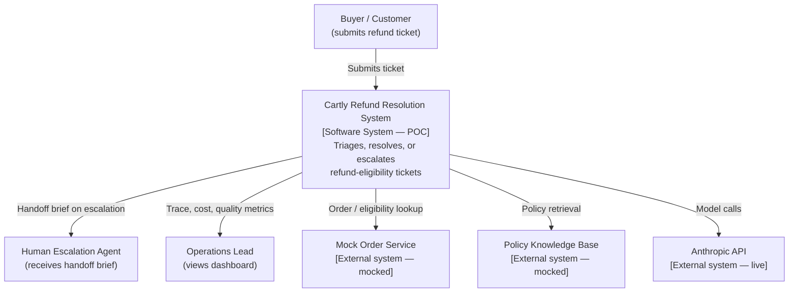

### 3.2 Level 2 — Container

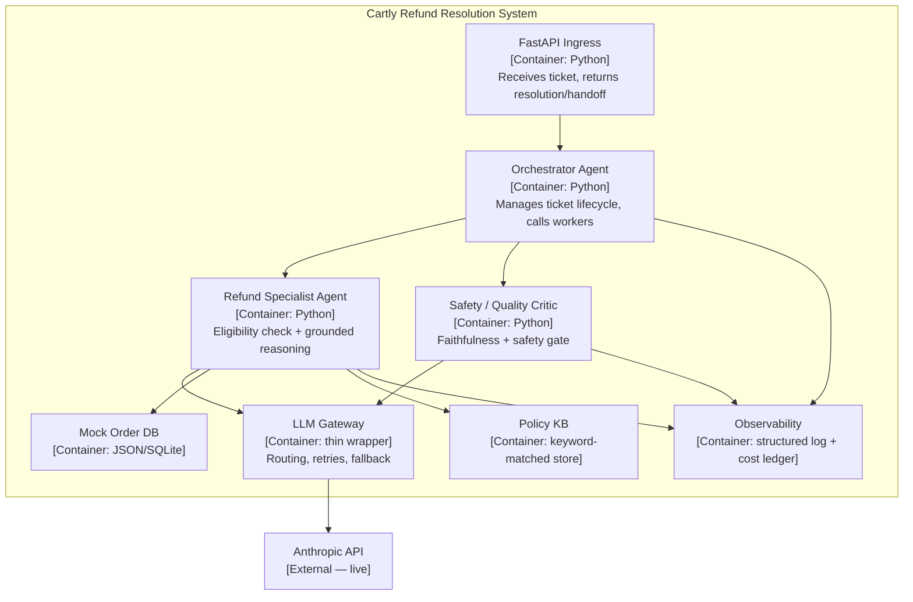

---

## 4. Black-Box / White-Box Views

### 4.1 Black box (what the outside world sees)

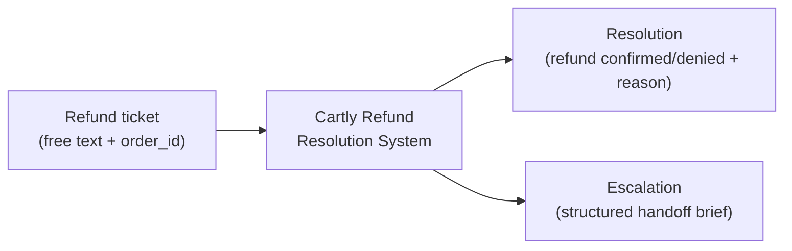
No internals visible. Input: a ticket. Output: either a resolved decision or a handoff package. This is the contract a stakeholder signs off on.

### 4.2 White box (internal decomposition)

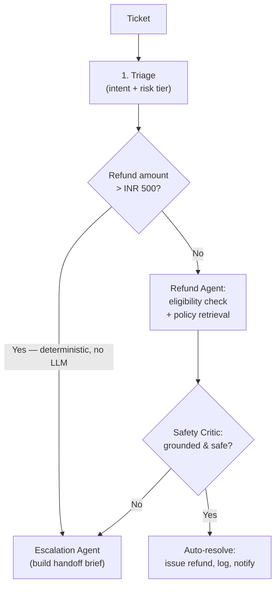

---

## 5. High-Level Design (HLD)

The system is an **orchestrator-worker** architecture with a **router** at the entry point and an **evaluator-optimizer** safety gate before any reply leaves the system. Inside each worker, execution is **sequential**. This mirrors the orchestration decision already recorded in the PDLC (Stage 3.3) — Sprint 1 implements it rather than re-deciding it.

**Data flow narrative:**
1. A ticket arrives at the FastAPI ingress and is handed to the Orchestrator.
2. The Orchestrator runs triage (intent + risk tier) and checks the deterministic INR 500 threshold **before any LLM call** — this is the one piece of logic that must never depend on a model.
3. If under threshold, the Refund Specialist Agent looks up the order, retrieves the relevant policy chunk, and produces a grounded eligibility decision with cited sources.
4. The Safety Critic independently re-verifies the citation (it does not trust the Refund Agent's claim) and checks the faithfulness score against the floor.
5. On pass, the Orchestrator resolves the ticket. On fail (threshold breach, critic rejection, or weak evidence), the Escalation path builds a structured handoff brief and the ticket exits to the human queue.
6. Every step — tool call, model call, decision — is written to the observability log with cost and latency.

**Components and single responsibilities:**

| Component | Responsibility | Model Tier |
|---|---|---|
| Orchestrator Agent | Lifecycle control, threshold gate, dispatch | None (rules) / cheap for triage |
| Refund Specialist Agent | Eligibility reasoning, grounded retrieval | Medium |
| Safety/Quality Critic | Independent faithfulness + safety verification | Medium |
| Mock Order DB | Deterministic order/eligibility data | — |
| Policy KB | Keyword-matched policy chunks (stands in for vector search) | — |
| Observability | Trace log + cost ledger | — |

---

## 6. Low-Level Design (LLD)

Each component below gets: responsibility detail, I/O schema, a **sequence diagram**, a **control-flow diagram**, and a **user-interaction diagram**. The three core agents (Orchestrator, Refund Agent, Safety Critic) get full treatment since they carry the architecturally interesting behavior; the supporting stores (Mock DB, Policy KB, Observability) get a lighter interface-level spec since they're deterministic utilities, not decision-makers.

### 6.1 Orchestrator Agent

**Responsibility:** Owns the ticket lifecycle end to end. Runs triage, enforces the deterministic refund threshold, dispatches to the Refund Agent or directly to Escalation, and applies the Safety Critic's verdict.

**Input schema:** `{ raw_ticket: string, channel: enum, order_id: string, claimed_amount: float, timestamp: ISO8601 }`
**Output schema:** `{ status: "resolved" | "escalated", resolution: object | null, handoff_brief: object | null }`

**Sequence diagram**
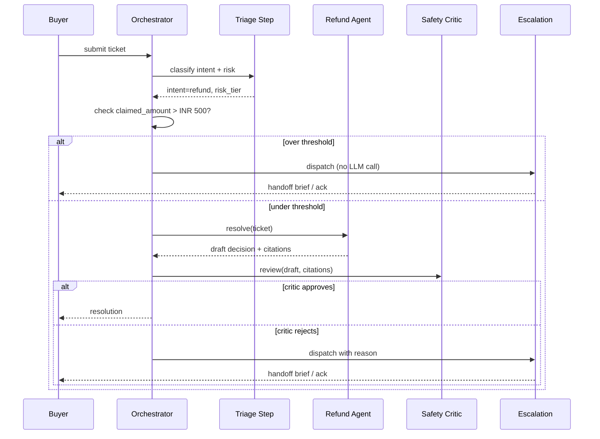

**Control flow diagram**
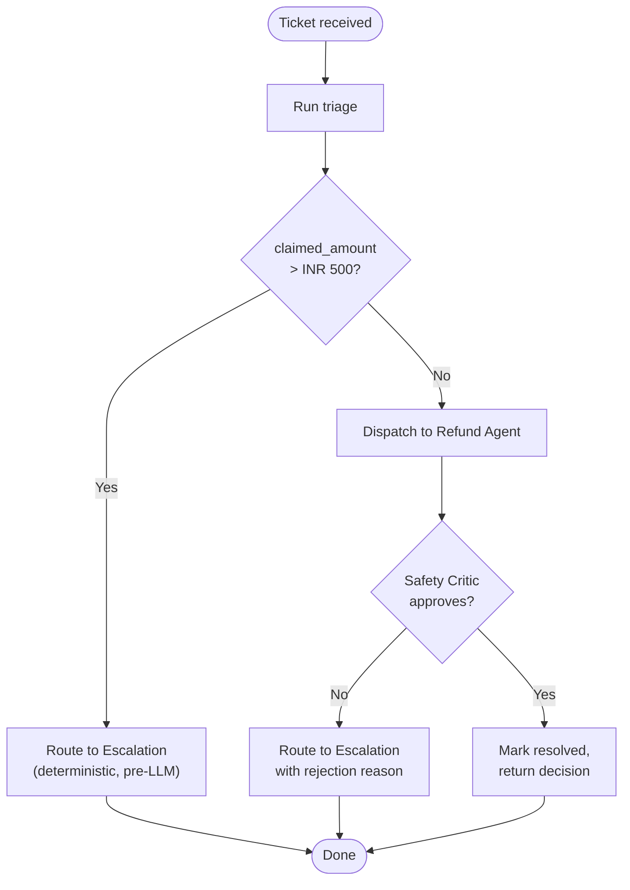

**User interaction diagram**
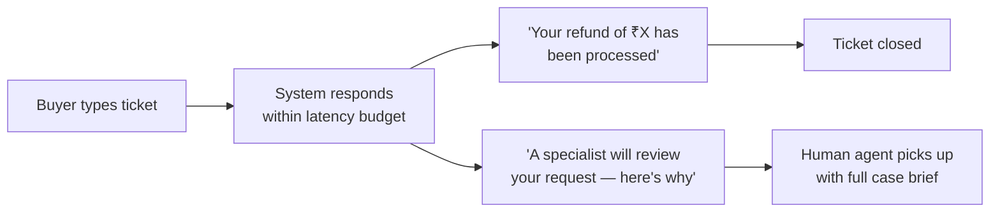

---

### 6.2 Refund Specialist Agent

**Responsibility:** Given a ticket under the threshold, look up the order, retrieve the applicable policy clause, and produce an eligibility decision grounded in both — never asserting eligibility without a citation.

**Input schema:** `{ order_id: string, refund_amount: float, reason: string }`
**Output schema:** `{ eligible: bool, action_taken: enum, source_refs: list, transaction_ref: string | null }`

**Sequence diagram**
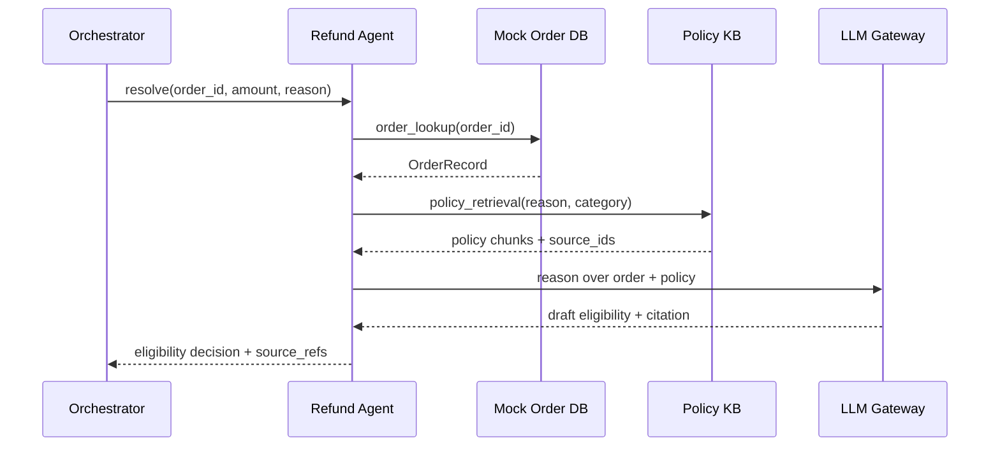

**Control flow diagram**
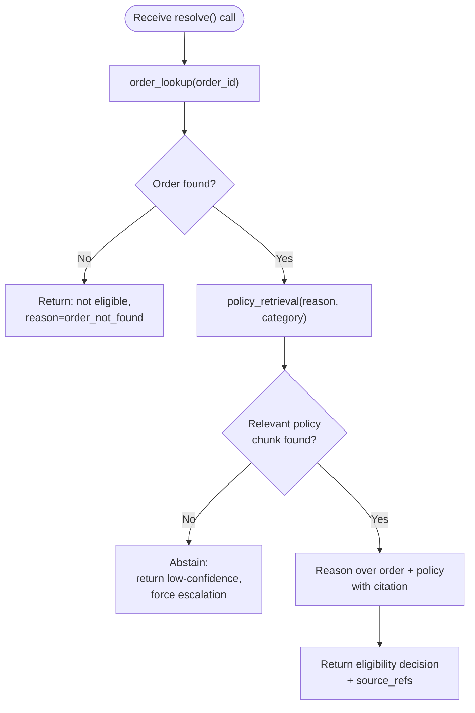

**User interaction diagram**
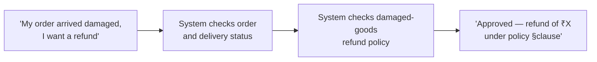

---

### 6.3 Safety / Quality Critic

**Responsibility:** Independently re-verify the Refund Agent's citation against the actual policy chunk (does not trust the agent's claim), and score faithfulness. Blocks anything below the floor or carrying a safety flag.

**Input schema:** `{ draft_response: string, context: object, source_refs: list }`
**Output schema:** `{ approved: bool, faithfulness_score: float, flags: list }`

**Sequence diagram**
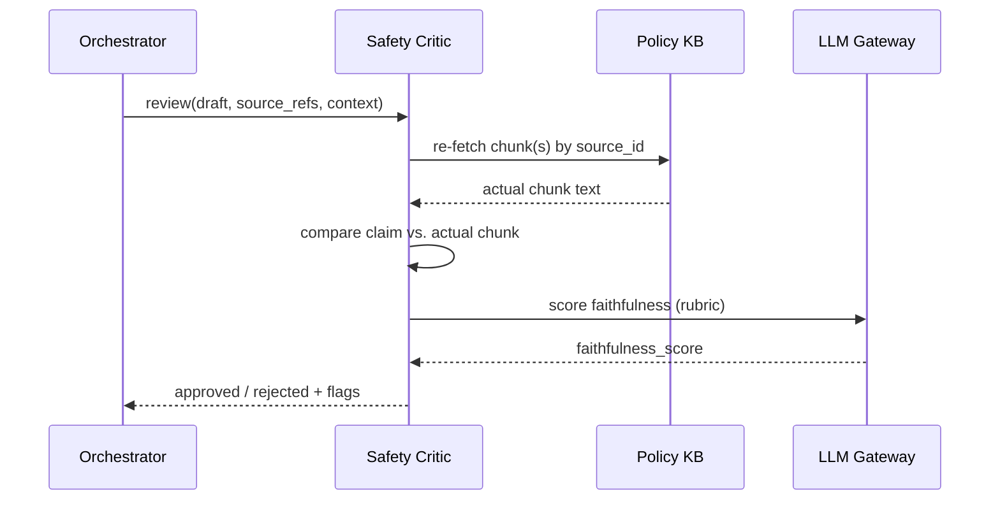

**Control flow diagram**
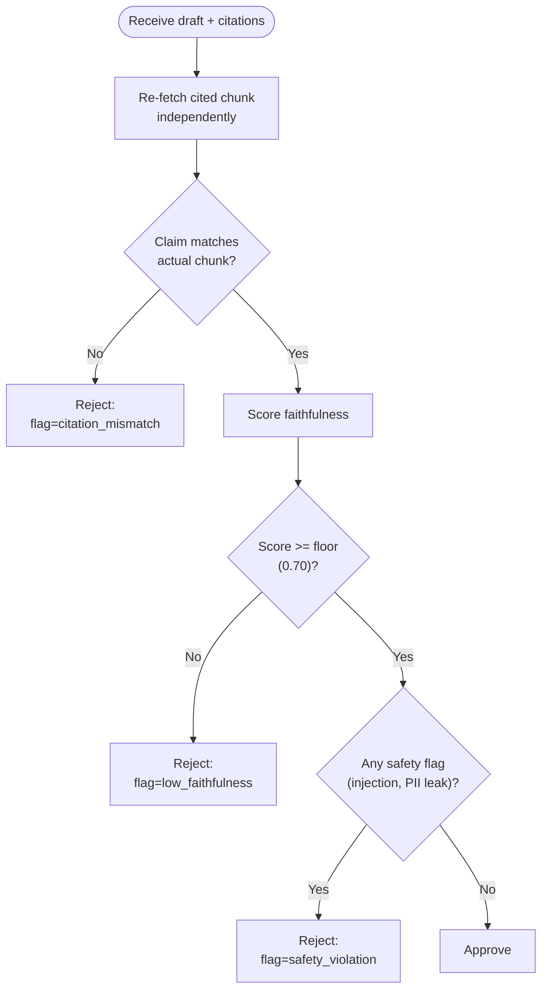

**User interaction diagram**
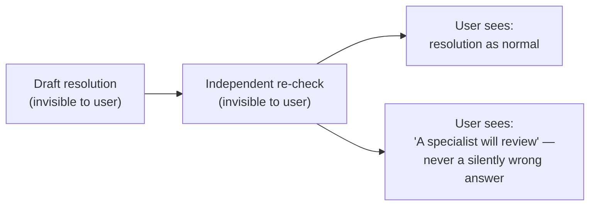

---

### 6.4 Supporting components (interface-level)

| Component | Interface | Sequence behavior | Control flow | User-facing? |
|---|---|---|---|---|
| Mock Order DB | `order_lookup(order_id) → OrderRecord` | Single deterministic call/response, no branching | N/A — lookup table | No, invisible |
| Policy KB | `policy_retrieval(query, category) → chunks` | Single deterministic call/response, keyword match | Returns top-k or empty | No, invisible |
| Observability | `log_event(step, cost, latency, decision)` | Fire-and-forget after every step above | N/A — append-only | No, surfaces only via dashboard |

---

## 7. Runtime View

Two paths, both bounded by the latency budget. The escalation path must be fast precisely *because* it skips the LLM.

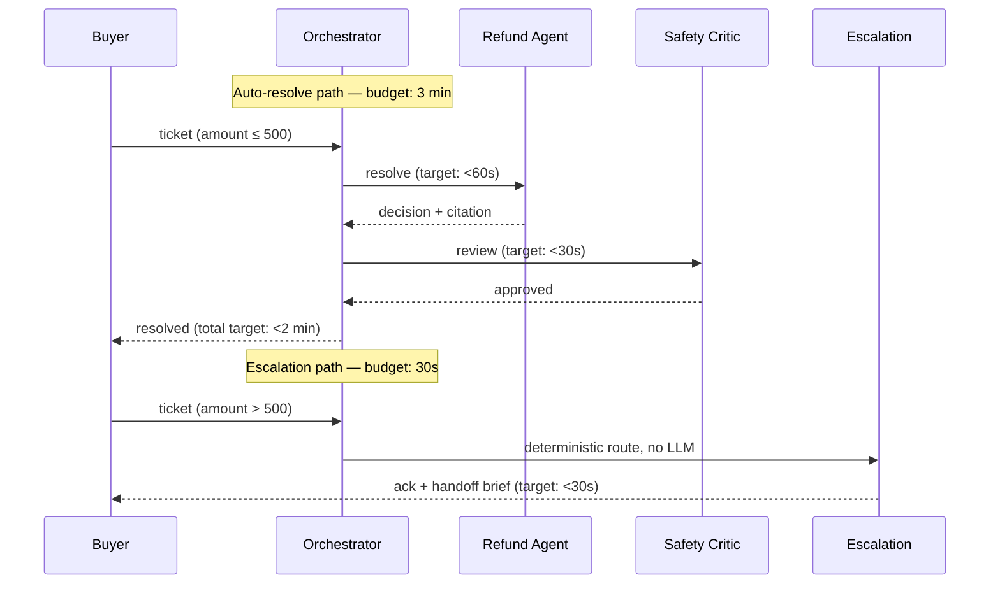

**Timing budgets** (inherited from PDLC NFRs): first response ≤30s, Tier-1 resolution ≤3 min. The threshold gate firing before any LLM call means the worst-case escalation latency is bounded by I/O, not by model inference — this was already verified in the brief's note that the escalation path fires correctly without LLM calls.

---

## 8. Deployment View — POC Topology

Single-host, docker-compose style for the POC; no orchestration platform needed at this scale.

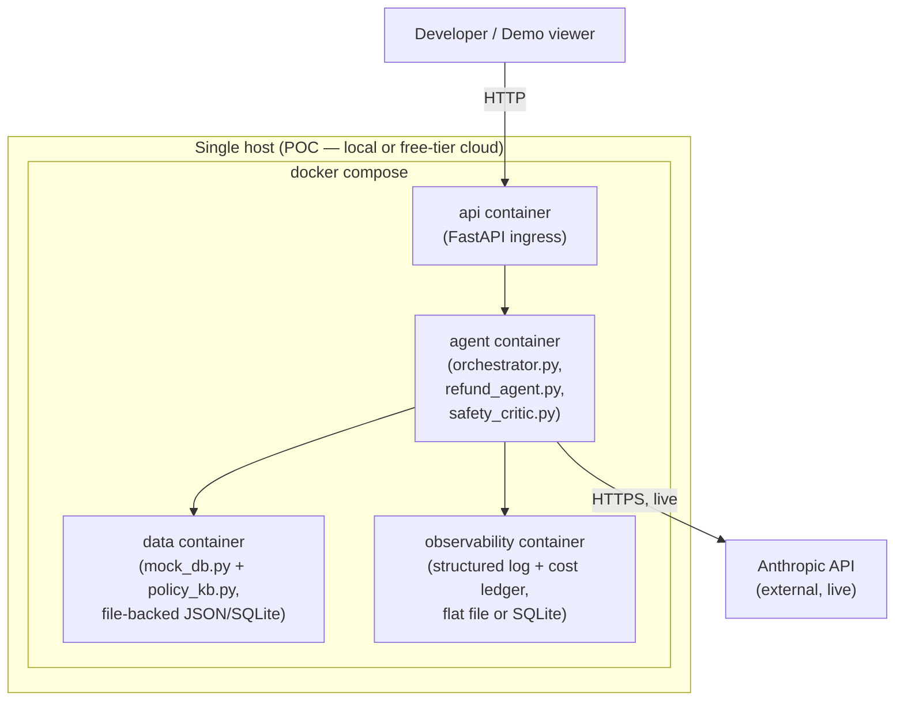

No live marketplace integration, no production database, no auth layer — this is explicitly a POC topology, not the Sprint 4 deployment target.

---

## 9. POC Definition — "Level 1 POC"

**Definition used for this sprint:** *Live agent reasoning, fully mocked world.* The LLM calls (Anthropic SDK) are real and live. Every external dependency the agents *read from* — order records, policy text — is deterministically mocked. Nothing in the POC talks to a real marketplace, a real payment processor, or a real policy CMS.

### 9.1 What's live
- Orchestrator triage reasoning (where it uses a model — the threshold gate itself is pure code, not a model call)
- Refund Agent's eligibility reasoning over retrieved context
- Safety Critic's faithfulness scoring

### 9.2 What's mocked
- Order data (`mock_db.py` — seeded fixed dataset covering the demo tickets)
- Policy text (`policy_kb.py` — keyword-matched, standing in for the Stage-5 vector store)
- Refund execution (`refund_action` returns a fabricated transaction ref, no real money moves)

### 9.3 Demo script (proves FR1–FR8)

| # | Ticket | Expected path | Proves |
|---|---|---|---|
| 1 | "My order #1042 arrived damaged, I'd like a ₹350 refund" | Auto-resolve | FR1–FR4, FR6, FR8 |
| 2 | "I want a ₹1200 refund for order #1077, it never arrived" | Deterministic escalation, no LLM call | FR5, FR8 |
| 3 | "Refund my order #1090, I'm entitled to a 30-day return on this electronics item" (policy actually says non-returnable) | Critic rejects / abstains → escalation | FR7 |
| 4 | "This is fraud, I'm contacting my lawyer about order #1099" | Hard-trigger keyword escalation | Demonstrates the kill-switch trigger list from the risk register |

Each run should be visible end-to-end in the observability trace — that trace *is* the proof of architecture, more than the final answer is.

---

## 10. Sprint 1 Task Breakdown & Equal Effort Allocation

21 tasks, grouped into three roughly equal tracks (~7 tasks / ~33% effort each). Tracks are built around skill continuity (whoever did related Sprint-0 work owns the natural follow-on) rather than forcing an arbitrary split — **assumption flagged**: the scrum update's owner tags ([P]/[A]/[E]) weren't resolvable to the three names with certainty, so this allocation is a fresh proposal for the team to confirm or swap at sprint planning, not a continuation of an assumed mapping.

| Track | Owner | Tasks | Effort |
|---|---|---|---|
| **Track 1 — Architecture & Diagrams** | **Avishka Jindal** | 1. POC scoping matrix + decision write-up (§1) 2. C4 L1 + L2 diagrams (§3) 3. Black-box/white-box views (§4) 4. HLD narrative (§5) 5. Runtime view (§7) 6. Deployment view (§8) 7. PRD amendment write-up (§2) | 7 tasks |
| **Track 2 — Agent LLD & Build** | **Hiten Mistry** | 1. Orchestrator LLD + 3 diagrams (§6.1) 2. Refund Agent LLD + 3 diagrams (§6.2) 3. `orchestrator.py` implementation 4. `refund_agent.py` implementation 5. `mock_db.py` + `policy_kb.py` fixtures 6. Deterministic threshold-gate unit tests 7. Demo ticket #1 and #2 wiring | 7 tasks |
| **Track 3 — Safety, Eval & Demo** | **Yash Parmar** | 1. Safety Critic LLD + 3 diagrams (§6.3) 2. `safety_critic.py` implementation 3. `observability.py` (trace log + cost ledger) 4. Demo ticket #3 and #4 wiring (policy-trap, hard-trigger) 5. End-to-end demo script + walkthrough notes 6. Functional requirements traceability check (FR1–FR8 → demo evidence) 7. Sprint 1 retro notes + Sprint 2 carry-forward list | 7 tasks |

**Shared/cross-cutting (touch all three, not separately counted):** the LLM Gateway wiring and the supporting-component spec (§6.4) sit at the seam between Track 2 and Track 3 — flag this as a pairing point mid-sprint rather than a solo task.

**Suggested cadence for the week:**
- Day 1: scoping + PRD lock (Track 1 leads, all three review and sign off — this gates everything else)
- Days 2–3: parallel build on Tracks 2 and 3; Track 1 finishes diagrams in parallel
- Day 4: integration — wire Orchestrator ↔ Refund Agent ↔ Safety Critic ↔ Observability
- Day 5: run all four demo tickets end to end, fix gaps, write retro

---

## Open items to confirm before Sprint 2
- Confirm the owner mapping above against actual role preference, not the assumption stated in §10.
- A2 (INR 500 threshold) and A4 (30s latency) remain unconfirmed assumptions per the PDLC register — the POC should still demonstrate the *mechanism* (a hard gate exists) even though the *value* is still provisional.
